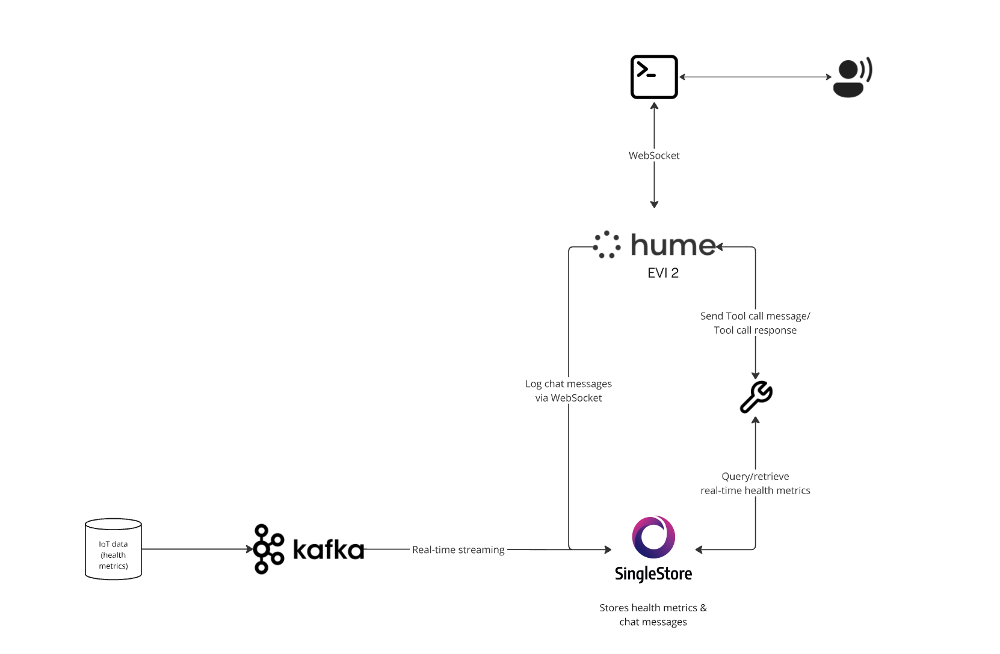

# Empathic Health Assistant
Empathic Health Companion is a real-time healthcare assistant that leverages Hume AI's Empathic Voice Interface (EVI 2) and SingleStore's high-performance database capabilities. The application processes user interactions and biometric data in real-time to provide personalized healthcare insights with an empathic touch.

## Features
- **Real-Time Interaction**: Supports live conversations powered by Hume AI's Empathic Voice Interface (EVI 2).
- **Emotional Awareness**: Detects and analyzes emotional cues to provide contextually relevant responses.
- **Health Data Integration**: Fetches and correlates real-time biometric data (e.g., heart rate, glucose levels) from SingleStore.
- **Kafka Integration**: Streams real-time biometric data into SingleStore.
- **Custom Tool Call**: Implements the `fetch_health_metrics` tool to dynamically retrieve and analyze user health metrics
- **Database-Driven Insights**: Utilizes SingleStore for low-latency queries and real-time data ingestion.

## Architecture


### Frontend
User interactions via terminal-based input.

### Backend
- WebSocket connection to Hume AI for real-time message processing and tool calls.
- Python backend for managing logic and database queries.
- Database: SingleStore for storing user messages, emotional features, and biometric data.

### Schema
#### Vitals table
Streamed into SingleStore via Kafka
```sql
CREATE TABLE vitals (
    patient_id INT,
    timestamp TIMESTAMP,
    heart_rate INT,
    blood_pressure VARCHAR(10),
    glucose_level DECIMAL(5,2),
    activity_level VARCHAR(20),
    SHARD KEY (patient_id, timestamp)
);
```
#### Chat_messages table
Streamed into SingleStore via Hume WebSocket
```sql
CREATE TABLE chat_messages (
    event_id VARCHAR(255) PRIMARY KEY,  
    chat_id VARCHAR(255),
    timestamp datetime(6),
    emotion_features JSON,
    message_text TEXT,
    shard key(event_id),
    sort key(timestamp)
);
```
### EVI Tool Configuration
Full tool setup instructions can be found in the [EVI docs](https://dev.hume.ai/docs/empathic-voice-interface-evi/tool-use#setup).
- Create a new tool `fetch_health_metrics` with the following schema
```json
{
   "type":"object",
   "required":["patient_id"],
   "properties":{
      "patient_id":{
         "type":"integer",
         "description":"Unique identifier for the patient whose metrics were fetched."
      },
      "metrics":{
         "type":"array",
         "description":"List of health metrics to fetch. Possible values include 'heart_rate', 'blood_pressure','glucose_level', and 'activity_level'.",
         "items":{
            "type":"string",
            "enum":[
               "heart_rate",
               "blood_pressure",
               "glucose_level",
               "activity_level"
            ]
         }
      }
   }
}
```
- Create a configuration `Health Metrics Config` that will utilize the `fetch_health_metrics` tool.
- Retrieve the `configuration ID` and pass it to your `.env` file

## Prerequisites
- Python 3.9 or 3.11 (Python 3.12 has incompatibility issues with the Hume SDK)
- [Hume AI API Key and Configuration](https://platform.hume.ai/)
- [SingleStore Database](https://www.singlestore.com/cloud-trial/)

## Setup
1. Clone the Repository
```bash
git clone https://github.com/your-username/empathic-health-companion.git
cd empathic-health-companion
```

2. Set Up Python Environment

Create and activate a Python virtual environment:

```bash
python -m venv venv
source venv/bin/activate
```
Install dependencies:

```bash
pip install -r requirements.txt
```

3. Configure Environment Variables
Create a `.env` file with your Hume API credentials and SingleStore database configuration:

```env
HUME_API_KEY=your-api-key
HUME_SECRET_KEY=your-secret-key
HUME_CONFIG_ID=your-config-id

SINGLESTORE_HOST=your-singlestore-host
SINGLESTORE_USER=your-username
SINGLESTORE_PASSWORD=your-password
SINGLESTORE_DATABASE=your-database
```

4. Run the Application
Start the WebSocket client:

```bash
python main.py
```

## Usage
Start a conversation via the terminal. 
Example:
```
You:
Hey, EVI. I’m not feeling too well at the moment.

EVI:
I’m sorry to hear that. Let me check on your health metrics to see how you’re doing physically.

[calls the `fetch_health_metrics` tool to fetch real-time vitals data from SingleStore]

EVI:
I noticed your average heart rate in the last hour has been 92 bpm, which is quite elevated compared to your usual baseline. 
Your glucose level is at 145 mg/dL, which is also on the higher side.
Stress can sometimes affect your heart rate and glucose levels. How about trying a short breathing exercise to help you relax?
```

## Next Steps
There are definitely opportunities to expand the functionality of Empathic Health Companion, especially around real-time healthcare insights! Here are some ideas:

### Correlation Analysis:
- Analyze relationships between detected emotions and health metrics.
- Example: Calculate average glucose levels or heart rates when a user's mood is classified as "angry" or "distressed."

### Full-Text Search on Historical Data:
- Leverage SingleStore's full-text search capabilities to query historical user conversations.
- Example: Find all instances where users expressed "sadness" and analyze associated health data trends.

### Historical Trend Analysis:
- Enable time-series analysis of emotional patterns and health metrics.
- Example: Generate reports showing fluctuations in emotional states alongside blood pressure or activity levels over a week.

### Sentiment-Based Alerts:
- Create automated alerts for caregivers or clinicians when specific emotional states or vitals exceed thresholds.
- Example: Notify a healthcare provider if the user is consistently detected as "angry" with rising blood pressure.